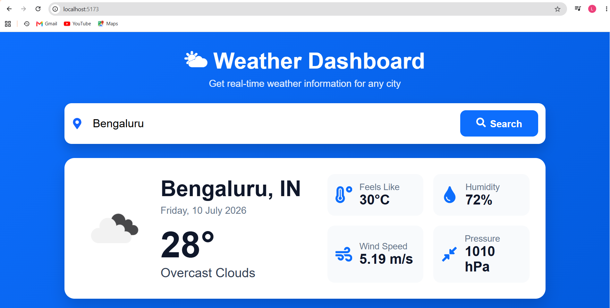
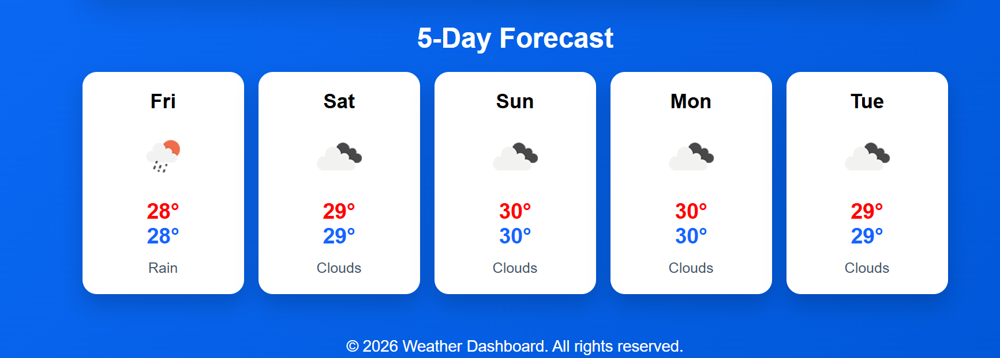

# 🌤 Weather Dashboard

A modern and responsive Weather Dashboard built using the **MERN Stack** that provides real-time weather information and a 5-day forecast for any city using the OpenWeather API.


---

## 🚀 Live Demo

### 🌐 Frontend (Vercel)
https://weather-dashboard-xxuw.vercel.app

### ⚙️ Backend (Render)
https://weather-dashboard-lnoh.onrender.com

---

## ✨ Features

- 🌍 Search weather by city name
- 🌡️ Real-time temperature
- 🌤️ Weather conditions with icons
- 🤗 Feels Like temperature
- 💧 Humidity
- 💨 Wind Speed
- 📈 Atmospheric Pressure
- 📅 5-Day Weather Forecast
- 📱 Fully Responsive UI
- ⚡ Fast API Integration
- 🔄 Dynamic Weather Updates

---

## 📸 Screenshots

### Home Page





---

## 🛠 Tech Stack

### Frontend
- React.js
- Vite
- Axios
- React Icons
- CSS3

### Backend
- Node.js
- Express.js
- MongoDB Atlas
- Mongoose
- JWT Authentication
- BcryptJS

### Weather API
- OpenWeather API

---

## 📂 Folder Structure

```
weather-dashboard
│
├── frontend
│   ├── public
│   ├── src
│   │   ├── components
│   │   ├── services
│   │   ├── assets
│   │   ├── App.jsx
│   │   ├── main.jsx
│   │   └── index.css
│   └── package.json
│
├── backend
│   ├── config
│   ├── controllers
│   ├── middleware
│   ├── models
│   ├── routes
│   ├── Utils
│   ├── server.js
│   └── package.json
│
└── README.md
```

---

## ⚙️ Installation

### 1. Clone Repository

```bash
git clone https://github.com/Lokanath2607/Weather_Dashboard.git
```

### 2. Go into Project

```bash
cd weather-dashboard
```

---

## 💻 Frontend Setup

```bash
cd frontend
npm install
npm run dev
```

Runs on

```
http://localhost:5173
```

---

## ⚙️ Backend Setup

```bash
cd backend
npm install
npm run dev
```

Runs on

```
http://localhost:5000
```

---

## 🔑 Environment Variables

Create a `.env` file inside the **backend** folder.

```env
PORT=5000

MONGO_URI=your_mongodb_connection_string

WEATHER_API_KEY=your_openweather_api_key

JWT_SECRET=your_secret_key
```

---

## 📡 API Endpoints

### Authentication

```http
POST /api/auth/register
```

```http
POST /api/auth/login
```

### Current Weather

```http
GET /api/weather?city=Delhi
```

### 5-Day Forecast

```http
GET /api/weather/forecast?city=Delhi
```

---

## 🌐 Deployment

| Service | Platform |
|----------|----------|
| Frontend | Vercel |
| Backend | Render |
| Database | MongoDB Atlas |

---

## 📦 Dependencies

### Frontend

- React
- Vite
- Axios
- React Icons

### Backend

- Express
- Axios
- Mongoose
- JWT
- BcryptJS
- Dotenv
- Cors

---

## 👩‍💻 Author

**Lokanath S**

🎓 BE (Artificial Intelligence & Machine Learning)

🔗 GitHub:
https://github.com/Lokanath2607

---

## ⭐ Show Your Support

If you like this project, please give it a ⭐ on GitHub.

---

## 📄 License

This project is licensed under the **MIT License**.
